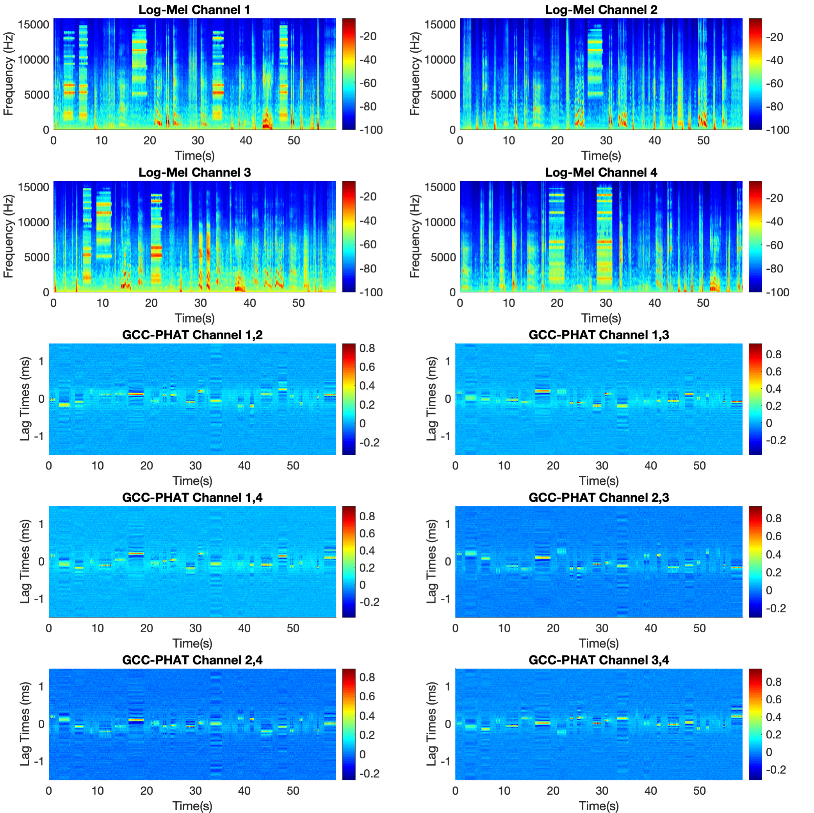
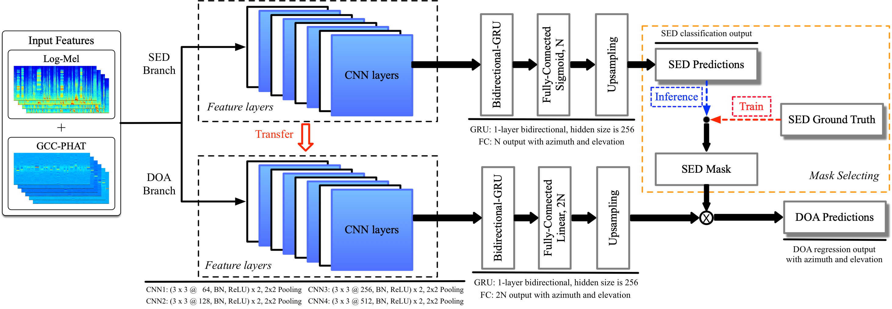
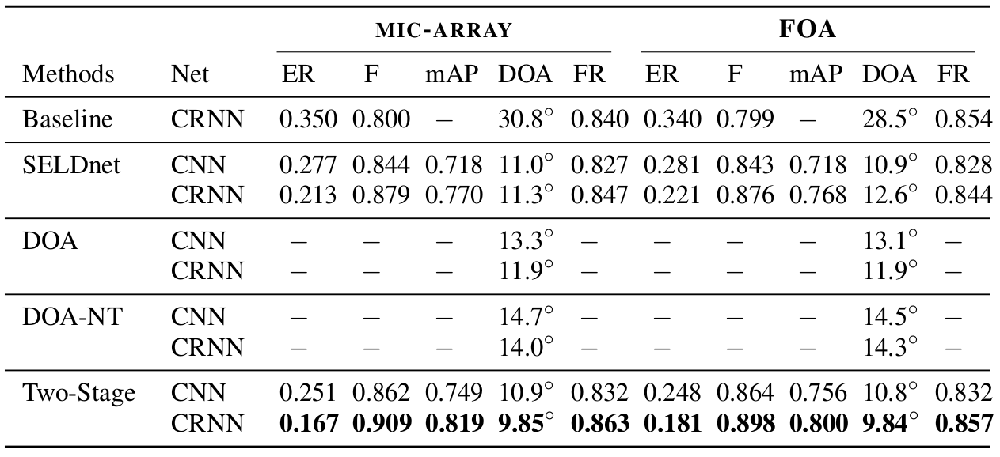
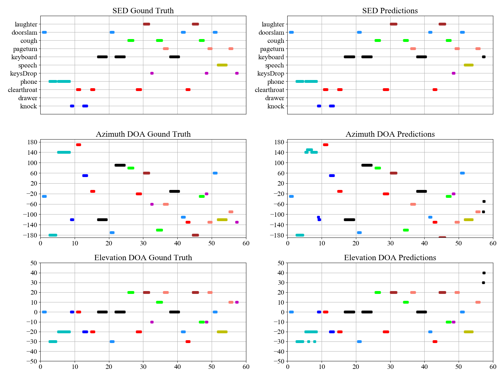
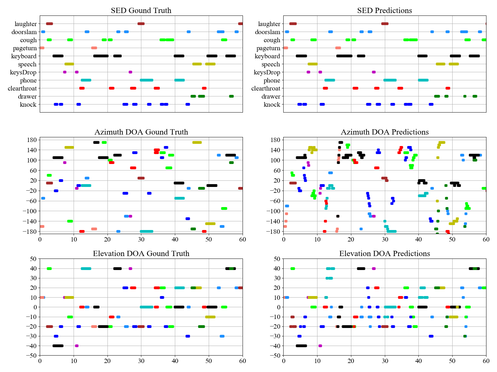

# Polyphonic-Sound-Event-Detection-and-Localization-using-a-Two-Stage-Strategy

Sound event detection (SED) and localization refer to recognizing sound events and estimating their spatial and temporal locations. In this repo, a Two-Stage Polyphonic Sound Event Detection and Localization method is implemented using pytorch. This method is tested on the DCASE 2019 Task 3 Sound Event Localization and Detection. More description of this task can be found in http://dcase.community/challenge2019/task-sound-event-localization-and-detection.

## Citation

The code in this repo is easy to understand and implement. If you use our codes in any format, please consider citing the following paper:

>[1] Yin Cao, Qiuqiang Kong, Turab Iqbal, Fengyan An, Wenwu Wang, Mark D. Plumbley. Polyphonic Sound Event Detection and Localization Using Two-Stage Strategy. arXiv preprint arXiv: 1905.00268v2
>Paper URL: https://arxiv.org/abs/1905.00268

You could also check our cross-task baseline method in https://github.com/qiuqiangkong/dcase2019_task3

## Dataset

The dataset can be downloaded from http://dcase.community/challenge2019/task-sound-event-localization-and-detection. This dataset contains 400 audio recordings splitted into 4 folds. Two formats of audios are givin: 1) First-Order of Ambisonics; 2) tetrahedral microphone array. There are 11 kinds of isolated sound events in total. The audio recordings are mixtures of isolated sound events and natural ambient noise. The sound events, which have a polyphony of up to two, are convolved with impulse responses collected from five indoor locations.

## The method

The input features used is log mel and GCC-PHAT spectrograms, the detailed description can be found in the paper.

### Input Features



Log mel features mainly focues on sound event detection, whereas GCC-PHAT features, which contains the time difference information between different channels, mainly deal with direction of arrival estimation.

### Network Architecture



Please refer to [[1]](https://arxiv.org/abs/1905.00268) for detailed description of the method.


## Using codes

### 0. Prepare data

Download and upzip the data, the data looks like:

<pre>
dataset_root
├── metadata_dev (400 files)
│    ├── split1_ir0_ov1_0.csv
│    └── ...
├── foa_dev (400 files)
│    ├── split1_ir0_ov1_0.wav
│    └── ...
├── mic_dev (400 files)
│    ├── split1_ir0_ov1_0.wav
│    └── ...
└── ...
</pre>

### 1. Requirements

python 3.6 + pytorch 1.0

### 2. Run the codes

I. Set the directories:

```shell
./0_directories.sh
```

II. Extract features:

```shell
./1_extract_features.sh
```

III. train a model:

```shell
./2_train.sh
```

IV. evaluataion:

```shell
./3_evaluation.sh
```

### 3. Training and evaluation
The model used is based on CRNN with 9 layers of CNN and 1 layer of RNN. The training of mini-batch size of 32 takes 210ms / batch on a single GTX 1080 Ti GPU. If you have GPU memory error, try to reduce the batch size. The training looks like:

For SED
<pre>
===> Building model

Utilize GPUs for computation

Number of GPU available: 1

...

Total number of parameters: 5890977

Loading training data time: 82.711 s.

Training audios number: 34624

Cross-Validation audios number: 100

Testing audios number: 100

----------------------------------------------------------------------------------------------------------------------------------------------
Train SELD loss: 0.010,  Train SED loss: 0.010,  Train DOA loss: 2.725,  Train SED mAP(micro): 0.926,  Train SED mAP(macro): 0.903
Valid SELD loss: 0.045,  Valid SED loss: 0.045,  Valid DOA loss: 2.659,  Valid SED mAP(micro): 0.845,  Valid SED mAP(macro): 0.790
Train ER: 0.031,  Train F-score: 0.984,  Train DOA error: 80.386,  Train DOA frame recall: 0.927,  Train SELD error: 0.142
Valid ER: 0.144,  Valid F-score: 0.920,  Valid DOA error: 78.376,  Valid DOA frame recall: 0.864,  Valid SELD error: 0.199
Iters: 52000,  Epochs/Batches: 48/64,  Train time: 42.015s,  Eval time: 47.036s
----------------------------------------------------------------------------------------------------------------------------------------------
Checkpoint saved to /vol/vssp/msos/YinC/workspace/DCASE2019/task3/mycode_v11/appendixes/models_saved/sed_only/model_CRNN10_mic_fold_1_seed_10/iter_52000.pth
----------------------------------------------------------------------------------------------------------------------------------------------
Train SELD loss: 0.010,  Train SED loss: 0.010,  Train DOA loss: 2.720,  Train SED mAP(micro): 0.927,  Train SED mAP(macro): 0.908
Valid SELD loss: 0.047,  Valid SED loss: 0.047,  Valid DOA loss: 2.596,  Valid SED mAP(micro): 0.836,  Valid SED mAP(macro): 0.792
Train ER: 0.035,  Train F-score: 0.982,  Train DOA error: 79.983,  Train DOA frame recall: 0.929,  Train SELD error: 0.142
Valid ER: 0.144,  Valid F-score: 0.918,  Valid DOA error: 77.175,  Valid DOA frame recall: 0.869,  Valid SELD error: 0.196
Iters: 52200,  Epochs/Batches: 48/264,  Train time: 43.011s,  Eval time: 46.227s
----------------------------------------------------------------------------------------------------------------------------------------------
</pre>

For DOA
<pre>
...

----------------------------------------------------------------------------------------------------------------------------------------------
Train SELD loss: 0.052,  Train SED loss: 0.000,  Train DOA loss: 0.052,  Train SED mAP(micro): 1.000,  Train SED mAP(macro): 1.000
Valid SELD loss: 0.349,  Valid SED loss: 0.000,  Valid DOA loss: 0.349,  Valid SED mAP(micro): 1.000,  Valid SED mAP(macro): 1.000
Train ER: 0.016,  Train F-score: 0.992,  Train DOA error: 1.003,  Train DOA frame recall: 0.957,  Train SELD error: 0.018
Valid ER: 0.015,  Valid F-score: 0.992,  Valid DOA error: 13.358,  Valid DOA frame recall: 0.955,  Valid SELD error: 0.036
Iters: 52000,  Epochs/Batches: 48/64,  Train time: 24.137s,  Eval time: 32.092s
----------------------------------------------------------------------------------------------------------------------------------------------
Checkpoint saved to /vol/vssp/msos/YinC/workspace/DCASE2019/task3/mycode_v11/appendixes/models_saved/doa_only/model_pretrained_CRNN10_mic_fold_1_seed_10/iter_52000.pth
----------------------------------------------------------------------------------------------------------------------------------------------
Train SELD loss: 0.049,  Train SED loss: 0.000,  Train DOA loss: 0.049,  Train SED mAP(micro): 1.000,  Train SED mAP(macro): 1.000
Valid SELD loss: 0.300,  Valid SED loss: 0.000,  Valid DOA loss: 0.300,  Valid SED mAP(micro): 1.000,  Valid SED mAP(macro): 1.000
Train ER: 0.020,  Train F-score: 0.990,  Train DOA error: 0.898,  Train DOA frame recall: 0.958,  Train SELD error: 0.019
Valid ER: 0.017,  Valid F-score: 0.991,  Valid DOA error: 11.775,  Valid DOA frame recall: 0.962,  Valid SELD error: 0.032
Iters: 52200,  Epochs/Batches: 48/264,  Train time: 24.184s,  Eval time: 31.095s
----------------------------------------------------------------------------------------------------------------------------------------------
</pre>


After training all of 4 folds, you can finally evaluate the performance. The evaluation looks like:

<pre>

Fold: 1

...

===> Inference for SED

===> Inference for SED and DOA
----------------------------------------------------------------------------------------------------------------------------------------------
Test SELD loss: 0.311,  Test SED loss: 0.045,  Test DOA loss: 0.311,  Test SED mAP(micro): 0.836,  Test SED mAP(macro): 0.783
Test ER: 0.149,  Test F-score: 0.916,  Test DOA error: 9.993,  Test DOA frame recall: 0.870,  Test SELD error: 0.105
----------------------------------------------------------------------------------------------------------------------------------------------
</pre>

### 4. Results
The two-stage method is compared with other methods, which are described in the paper. Please refer to [[1]](https://arxiv.org/abs/1905.00268) for detailed results and discussions.

Final results can be seen below:



The visualization of prediction results for no overlapping sound:



The visualization of prediction results for overlapping sound:




### 5. Summary

This code is the implementation of the Polyphonic Sound Event Detection and Localization Using Two-Stage Strategy.


## License
File metrics/cls_feature_class.py and metrics/evaluation_metrics.py are under TUT_LICENSE. 

All other files are under MIT_LICENSE. 

## External link

[2] http://dcase.community/challenge2019/task-sound-event-localization-and-detection

[3] https://github.com/sharathadavanne/seld-dcase2019
